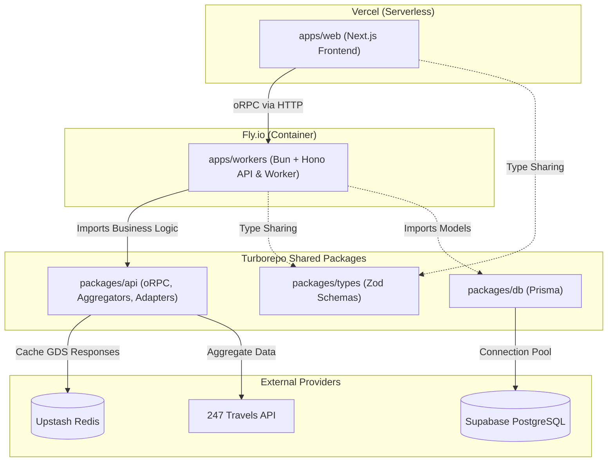

# Master-Trip Monorepo Architecture

Welcome to the Master-Trip codebase. We use Turborepo to manage our code, allowing us to strictly separate the fast, user-facing UI from the heavy, high-concurrency background processors.

This document serves as the master architectural reference for all developers working on the project.

---

## Architecture Diagram

Below is a visual representation of how the deployments and internal packages communicate:

---

## Directory Structure & Responsibilities

### 1. apps/web (The Frontend)
- **What it is:** A React/Next.js application.
- **Where it deploys:** Vercel (Serverless/Edge).
- **What it does:** Renders the UI and serves the HTML/CSS/JS. It does not directly contact the flight providers or the database. It only communicates with the backend via the oRPC React Query client.
- **Why Serverless:** It scales instantly to zero when there is no traffic and serves UI assets globally via CDNs for maximum speed.

### 2. apps/workers (The API Server & AI Worker)
- **What it is:** A Bun + Hono server containing our Mastra AI Agents.
- **Where it deploys:** Fly.io or AWS ECS (Always-On Docker Container).
- **What it does:** 
  1. Live Search: Mounts the oRPC router to answer live flight/hotel queries from apps/web.
  2. Async Fulfillment: Listens for QStash webhooks to run the Mastra AI agents. When a user pays for a flight, checkout finishes instantly, and QStash pings this worker to securely talk to the airline APIs in the background.
- **Why Bun+Hono:** We expect massive concurrency spikes (e.g., 10,000 users searching for flights at once). Bun+Hono is astronomically faster than Express/Next.js and allows us to use "Request Coalescing" (in-memory waiting rooms) to protect the APIs from crashing.

### 3. packages/api (The Brains / Business Logic)
- **What it is:** Pure TypeScript logic that is completely framework-agnostic.
- **What it does:** This folder contains the oRPC Routers, the Aggregators, and the Adapters (e.g., 247 Travels, Booking.com).
- **How it is used:** apps/workers imports this package and wraps it inside Hono to serve to the web. 
- *Note:* Do not put HTTP server code (like req/res or Express plugins) in this folder.

### 4. packages/db (The Database)
- **What it is:** PostgreSQL schema managed via Prisma ORM.
- **What it does:** Handles database migrations, Prisma Client generation, and database configuration (prisma.config.ts).
- **Data Protection:** We use strict Prisma middleware to automatically isolate data by userId to prevent data leaks.

### 5. packages/types (The Contracts)
- **What it is:** Zod validation schemas.
- **What it does:** Used by the backend to validate incoming data, and by the frontend to know exactly what the backend will return. This guarantees 100% end-to-end type safety.

---

## How Data Flows

1. The user clicks "Search Flights" on `apps/web`.
2. The oRPC client inside `apps/web` sends a JSON request to the `apps/workers` API Server running on Fly.io.
3. The Bun+Hono server receives the request, runs the Aggregator from `packages/api`, pulls cached data from Redis, and applies the Postgres Markup rules from `packages/db`.
4. The server returns the strictly typed JSON back to `apps/web`.

## Getting Started Locally

1. Install dependencies using Bun or pnpm: `pnpm install`
2. Start the database (ensure your .env contains the Supabase Postgres URL).
3. Push the database schema: `cd packages/db && pnpm db:push`
4. Run the entire monorepo: `pnpm dev` (This will start the Next.js frontend on port 3000, and the Bun/Hono server on port 8080).
