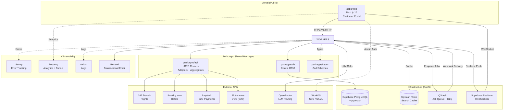

# Master-Trip — System Architecture

> Turborepo monorepo. Multi-vertical travel booking platform (Flights, Hotels, Tours, Cars) with an autonomous AI support agent and a full internal operations dashboard.

---

## Monorepo Structure

```
master-trip/
├── apps/
│   ├── web/          → Next.js 16 (App Router) — Vercel (Unified Portal + Admin)
│   └── workers/      → Bun + Hono + Mastra — Fly.io
├── packages/
│   ├── api/          → oRPC routers, adapters, aggregators (framework-agnostic)
│   ├── db/           → Drizzle ORM schema + client (Supabase PostgreSQL)
│   ├── types/        → Zod validation schemas (shared contract)
│   ├── ui/           → Shared React component library
│   └── eslint-config / typescript-config
└── turbo.json
```

---

## Apps

### `apps/web` — Next.js Frontend (Unified Customer Portal & Operations Dashboard)
| Property | Detail |
|---|---|
| Framework | Next.js 16 (App Router) |
| Deploys to | Vercel (Serverless / Edge CDN) |
| Port (local) | `3000` |
| Communicates via | oRPC React Query client → `apps/workers` |
| Auth | Unified Auth (Magic Link for guests, SAML/SSO for Admin/Ops via WorkOS) |
| Never does | Direct DB queries, raw provider API calls |

**Route Groups:**

```
apps/web/app/
│
├── (customer)/                  ← Public-facing portal (CUSTOMER role)
│   ├── page.tsx                 ← Landing / home
│   ├── flights/                 ← Flight search + results
│   ├── hotels/                  ← Hotel search + results
│   ├── tours/                   ← Tour search + results
│   ├── cart/                    ← Unified trip cart (all verticals)
│   ├── checkout/                ← Paystack payment init + confirmation
│   └── support/                 ← AI chat + realtime human handoff
│
├── (admin)/                     ← Internal Operations Dashboard (ADMIN / OPERATIONS roles)
│   ├── support/                 ← Support queue + human takeover
│   ├── bookings/                ← Full trip lifecycle management
│   ├── fulfillment/             ← QStash job monitor + DLQ intervention
│   ├── markup/                  ← Markup rules CRUD engine
│   ├── finance/                 ← Paystack splits + Flutterwave VCC
│   ├── ai-ops/                  ← OpenRouter cost + agent KPIs
│   ├── knowledge/               ← pgvector policy document manager
│   ├── analytics/               ← Revenue, funnel, routes, retention
│   └── users/                   ← User management + WorkOS SSO orgs
```

---

### `apps/workers` — Bun + Hono API Server & AI Worker
| Property | Detail |
|---|---|
| Runtime | Bun |
| Framework | Hono |
| Deploys to | Fly.io (always-on container) |
| Port (local) | `8080` |
| Concurrency | Handles 10,000+ RPS via request coalescing |

**Responsibilities:**

| Endpoint / Job | What it does |
|---|---|
| `GET/POST /api/*` | Mounts `packages/api` oRPC router — serves live search to `apps/web` |
| `POST /webhook/fulfillment` | QStash receiver — validates signature, triggers Mastra fulfillment agent |
| `POST /webhook/support` | QStash receiver — triggers Mastra support agent with userId context |
| Mastra: `fulfillmentAgent` | Iterates `TripItem[]`, calls provider adapters, updates DB state |
| Mastra: `supportAgent` | RAG-powered AI chat, reads user itinerary, escalates to human if needed |

```
apps/workers/src/
├── server.ts              ← Hono entry point
├── mastra/                ← Mastra framework config
└── agents/
    ├── fulfillment.ts     ← Books each TripItem with provider APIs
    └── support.ts         ← GPT-4o via OpenRouter, pgvector RAG, VIP escalation
```

---

## Packages

### `packages/api` — Business Logic (oRPC)
| Property | Detail |
|---|---|
| What it is | Pure, framework-agnostic TypeScript |
| What it contains | oRPC routers, provider adapters, aggregators, markup engine |
| Hard rule | **No** `req`, `res`, Hono, Express, or Fastify code. Ever. |

```
packages/api/src/
├── router.ts                        ← Root oRPC router
├── procedures.ts                    ← Base + auth middleware
├── routers/
│   ├── flights.ts                   ← Flight search + Redis cache
│   ├── hotels.ts                    ← Hotel search + Redis cache
│   ├── bookings.ts                  ← Cart, Paystack init, webhook
│   ├── support.ts                   ← Chat history, message dispatch
│   └── tours.ts                     ← Tours (future)
└── providers/
    ├── flights/
    │   ├── registry.ts              ← Provider plug-in array
    │   ├── aggregator.ts            ← Fan-out + request coalescing
    │   └── adapters/
    │       └── travels247.adapter.ts ← 247 Travels: auth, normalize, book, revalidate
    ├── hotels/
    │   ├── registry.ts
    │   ├── aggregator.ts            ← B2B room accumulator (splits 50-room orders)
    │   └── adapters/
    │       └── booking-com.adapter.ts ← Booking.com: auth, normalize, bulk rooms
    └── pricing/                     ← MarkupRule engine (DB-driven, no deploy needed)
```

**Adapter Pattern — How providers plug in:**
```typescript
const flightProviders = [new Travels247Adapter(env.KEY), /* future providers */];
const results = await Promise.allSettled(
  flightProviders.map(p => p.searchFlights(input))
);
// Provider crash = auto-fallback to others. Zero downtime.
```

**B2B Accumulator — 50-room corporate order:**
```typescript
let needed = 50;
const sorted = sortCheapestFirst(await Promise.allSettled(hotelProviders.map(p => p.searchRooms(input))));
for (const api of sorted) {
  if (needed === 0) break;
  const take = Math.min(api.availableRooms, needed);
  finalOrder.push({ provider: api.name, rooms: take });
  needed -= take;
}
```

---

### `packages/db` — Database (Drizzle ORM + Supabase)
| Property | Detail |
|---|---|
| ORM | Drizzle ORM |
| Database | PostgreSQL (hosted on Supabase) |
| Extensions | `pgvector` (RAG for AI support agent) |
| Hard rule | All schema changes via `src/schema.ts` + `drizzle-kit push`. Never raw SQL on Supabase. |

**Core Models:**

| Model | Purpose |
|---|---|
| `User` | Person who pays. Has `UserRole` + `UserTier` |
| `Traveler` | Person who travels. Decoupled from User (corporate can book for staff) |
| `Trip` | The unified cart. One payment covers all verticals |
| `TripItem` | Polymorphic — FLIGHT / HOTEL / TOUR / CAR. JSONB metadata per vertical |
| `Payment` | Paystack reference, amount, status |
| `Refund` | Partial or full. Linked to Payment |
| `MarkupRule` | Ops-managed pricing rules. Route / cabin / tier / vertical scoped |
| `SupportChat` | Full chat history. Role: USER / ASSISTANT / HUMAN_AGENT |

**Enums:**
```
TripStatus:        DRAFT → PAID → FULFILLING → CONFIRMED / PARTIAL_FAIL / CANCELLED / REFUNDED
FulfillmentStatus: PENDING → CONFIRMED / FAILED / REFUNDED
UserRole:          CUSTOMER / SUPPORT_AGENT / OPERATIONS / ADMIN
UserTier:          STANDARD / VIP / CORPORATE
ChatStatus:        ACTIVE / NEEDS_HUMAN / NEEDS_HUMAN_URGENT / RESOLVED
```

---

### `packages/types` — Zod Schemas (Shared Contract)

Shared between `apps/web`, `packages/api`, and `apps/workers`.
Defines `FlightResult`, `HotelResult`, `TripItem`, and all oRPC input/output shapes.
No frontend-backend drift. Ever.

---

### `packages/ui` — Shared Component Library

Shared React components (buttons, cards, tables, modals) used by both the customer portal and admin dashboard.

---

## External Services

| Service | Provider | Used For |
|---|---|---|
| **Database** | Supabase (PostgreSQL) | All persistent data + `pgvector` for AI RAG |
| **Realtime** | Supabase Realtime | VIP/urgent chat escalation pings to admin dashboard |
| **Cache** | Upstash Redis | GDS search result caching (prevents rate limit breaches) |
| **Queue** | QStash (Upstash) | Async fulfillment jobs + DLQ (3× retry + exponential backoff) |
| **Flights** | 247 Travels API | IATA-certified consolidator, direct airline inventory |
| **Hotels** | Booking.com API | Reliable lodging — reservation guaranteed in hotel's system |
| **Payments (B2C)** | Paystack | Customer checkout — captures full trip amount |
| **Payments (B2B)** | Flutterwave Issuing | Virtual Credit Cards (VCC) to pay provider APIs per booking |
| **Auth** | WorkOS | SAML/SSO for corporate clients and internal ops (Admin) |
| **AI LLM Routing** | OpenRouter | Unified API — swap GPT-4o / Claude / open-source. Prevents vendor lock-in |
| **Emails** | Resend | Transactional — e-tickets, itineraries, deal blast alerts, magic links |
| **File Uploads** | UploadThing | Passport / ID document uploads (serverless, zero infra) |
| **Analytics** | PostHog | Checkout funnel drop-off tracking, session replay |
| **Error Tracking** | Sentry | Runtime oRPC + Next.js error capture |
| **Logging** | Axiom / Grafana | Aggregated logs from Vercel + Fly.io workers |

---

## Role-Based Access Control (RBAC)

Enforced at **three independent layers**.

**The roles:**
```prisma
enum UserRole {
  CUSTOMER        // Client portal only — never touches the internal dashboard
  SUPPORT_AGENT   // Support queue + read-only booking view
  OPERATIONS      // Bookings, fulfillment, markup, finance
  ADMIN           // Full access — all 9 dashboard sections
}
```

**Access matrix:**

| Dashboard Section | SUPPORT_AGENT | OPERATIONS | ADMIN |
|---|:---:|:---:|:---:|
| 1. Support Queue | ✅ | ❌ | ✅ |
| 2. Booking Management | ✅ read-only | ✅ full | ✅ full |
| 3. Fulfillment Monitor | ❌ | ✅ | ✅ |
| 4. Markup Rules Engine | ❌ | ✅ | ✅ |
| 5. Finance & Payments | ❌ | ✅ | ✅ |
| 6. AI Ops Panel | ❌ | ❌ | ✅ |
| 7. Knowledge Base Manager | ❌ | ✅ | ✅ |
| 8. Analytics & Reporting | ❌ | ❌ | ✅ |
| 9. User Management | ❌ | ❌ | ✅ |

**Enforcement:**

| Layer | Mechanism | Effect |
|---|---|---|
| **1. Backend** | oRPC procedure middleware checks `context.userRole` | `403 FORBIDDEN` if role insufficient |
| **2. Frontend** | Next.js middleware blocks access to `(admin)/*` based on Auth session role | Redirect to 403 / Login |
| **3. Database** | Drizzle filters appends `where eq(userId, ...)` to all customer queries | No cross-user data leak |

---

## Data Flows

### 1. Search Flow
```
User searches flights on apps/web
    → oRPC client → apps/workers (Hono)
    → packages/api: check Upstash Redis cache
        → Cache HIT: return cached result instantly
        → Cache MISS: fan-out to 247 Travels API + future providers (parallel)
            → normalize responses via adapter
            → apply MarkupRule engine (from DB)
            → cache result in Redis
            → return to apps/web
```

### 2. Checkout & Payment Flow
```
User confirms cart (Trip + TripItems[]) on apps/web
    → oRPC createTrip → save Trip + TripItems to DB (status: DRAFT)
    → oRPC initPayment → revalidate prices with provider APIs
    → Paystack: generate payment link
    → User completes payment on Paystack
    → Paystack webhook: charge.success
        → DB: Trip.status = PAID
        → Payment record created (paystackReference)
        → QStash: emit CheckoutComplete event
        → Return success to apps/web instantly
```

### 3. Async Fulfillment Flow
```
QStash delivers CheckoutComplete to apps/workers /webhook/fulfillment
    → Validate QStash signature
    → Mastra fulfillmentAgent: load Trip + TripItems from DB
    → For each TripItem (parallel where possible):
        → FLIGHT: Travels247Adapter.bookFlight() → PNR returned
            → DB: TripItem.fulfillmentStatus = CONFIRMED
        → HOTEL: BookingComAdapter.bookHotel() → confirmation ID returned
            → DB: TripItem.fulfillmentStatus = CONFIRMED
    → All confirmed: Trip.status = CONFIRMED
        → Resend: email PDF itinerary + e-ticket to user
    → Any item fails after 3 QStash retries:
        → DB: TripItem.fulfillmentStatus = FAILED
        → DB: Trip.status = PARTIAL_FAIL
        → Paystack: partial refund for failed item(s)
        → Resend: notify user with alternatives
        → Admin DLQ queue lights up in dashboard
```

### 4. AI Support Flow
```
User sends message in support chat on apps/web
    → oRPC supportRouter.sendMessage → saved to SupportChat (role: USER)
    → QStash: emit support job with userId context
    → apps/workers: Mastra supportAgent
        → Drizzle (userId-isolated): load user's full Trip + TripItems
        → pgvector RAG: search airline/visa policy database for relevant rules
        → OpenRouter: send context + policy + user message to LLM (GPT-4o)
        → AI response saved to SupportChat (role: ASSISTANT)
        → Supabase Realtime: push response to apps/web chat UI

    If escalation triggered (VIP tier / distress / confidential):
        → DB: SupportChat.status = NEEDS_HUMAN_URGENT
        → Supabase Realtime: ping internal support dashboard
        → Human agent takes over → messages as role: HUMAN_AGENT
        → Agent resolves → SupportChat.status = RESOLVED
```

---

## Architecture Diagram



---

## Coding Rules (Non-Negotiable)

| Rule | Where | What |
|---|---|---|
| Business logic | `packages/api/src/` | All provider integrations, oRPC endpoints, aggregators |
| No HTTP code in api | `packages/api/src/` | Zero `req`/`res`/Hono/Express. Pure TypeScript only |
| UI code | `apps/web/app/` | React/Next.js only. No DB queries, no raw API calls |
| DB changes | `packages/db/src/schema.ts` | Always through Drizzle. Never alter Supabase directly |
| Request coalescing | `packages/api/src/providers/*/aggregator.ts` | Dedup logic here, not in Hono server |
| Auto-scaling | `apps/workers/fly.toml` | Infra config lives here only |
| Type contracts | `packages/types/src/` | All shared Zod schemas. Frontend and backend use same types |

---

## Getting Started

```bash
# 1. Install
pnpm install

# 2. Configure environment
cp .env.example .env.local
# Fill in: DATABASE_URL, UPSTASH_*, QSTASH_*, PAYSTACK_*, OPENROUTER_*, WORKOS_*

# 3. Push DB schema
cd packages/db && pnpm db:push

# 4. Run everything
pnpm dev
# → apps/web     on http://localhost:3000 (Customer & Admin)
# → apps/workers on http://localhost:8080
```

## Environment Variables

| Variable | Service | Used By |
|---|---|---|
| `DATABASE_URL` | Supabase PostgreSQL | `packages/db` |
| `DIRECT_URL` | Supabase (migrations) | `packages/db` |
| `UPSTASH_REDIS_REST_URL` | Upstash Redis | `packages/api` |
| `UPSTASH_REDIS_REST_TOKEN` | Upstash Redis | `packages/api` |
| `QSTASH_URL` | QStash | `apps/workers` |
| `QSTASH_TOKEN` | QStash | `apps/workers` |
| `QSTASH_CURRENT_SIGNING_KEY` | QStash signature | `apps/workers` |
| `TRAVELS247_API_KEY` | 247 Travels | `packages/api` |
| `BOOKINGCOM_API_KEY` | Booking.com | `packages/api` |
| `PAYSTACK_SECRET_KEY` | Paystack | `packages/api` |
| `FLUTTERWAVE_SECRET_KEY` | Flutterwave VCC | `packages/api` |
| `OPENROUTER_API_KEY` | OpenRouter | `apps/workers` |
| `WORKOS_API_KEY` | WorkOS | `apps/web` |
| `WORKOS_CLIENT_ID` | WorkOS | `apps/web` |
| `RESEND_API_KEY` | Resend | `apps/workers` |
| `SENTRY_DSN` | Sentry | `apps/web`, `apps/workers` |
| `NEXT_PUBLIC_POSTHOG_KEY` | PostHog | `apps/web` |
| `WORKER_URL` | Internal | `apps/web` → points to `apps/workers` |
